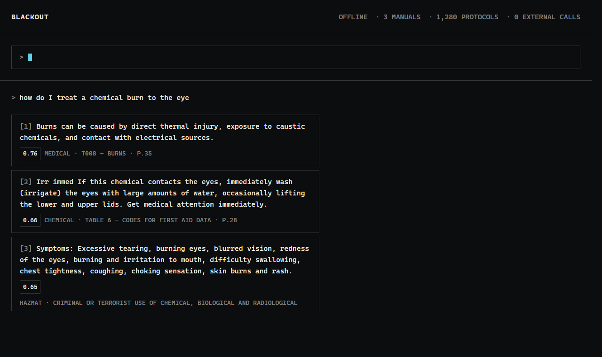
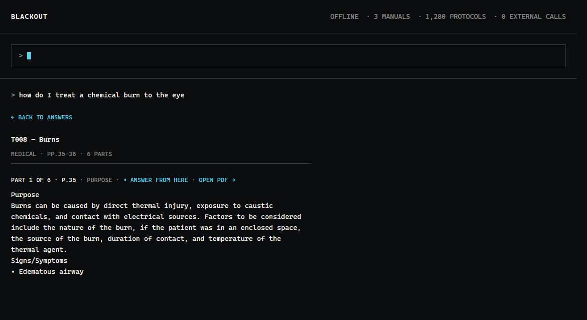

# BLACKOUT — Offline Field Protocol Assistant

Answers plain-English questions from federal and state emergency response guides, with no network connection of any kind.

Built at VTHacks 14 for the Peraton Mission-Critical AI track.

## Authors

- William Perryman
- Edwin Barrack

## Why

When responders most need a protocol manual, the network is often gone — grid outages outlast cell-site batteries, backhaul gets cut, networks congest during mass-casualty events, and basements and tunnels have no signal at all. BLACKOUT has no dependency to lose.

It also never generates text. Every answer is the manual's own wording, shown with its source and page number, so it can be verified. When a question isn't covered by the loaded protocols, it says so instead of guessing.

## Features

- **Fully offline.** No API keys and no network calls. The only server is a local one on your own machine, so it runs in airplane mode.
- **Three answers, then the whole protocol.** A question returns one verbatim sentence from each of the three best-matching protocols. Open one and the full protocol follows, part by part.
- **Cited answers.** Every part shows its manual and page, and links into the PDF at that page.
- **Abstains when unsure.** Below the confidence threshold it refuses rather than guessing.
- **Semantic search.** Matches meaning, not keywords — "can't catch their breath" finds "respiratory distress."
- **Possible future features.** Offline voice input, store-and-forward sync for field reports, protocol updates when a link is available.

## Sources

| Manual | Domain |
| --- | --- |
| ERG 2024 (PHMSA) | Hazmat and transport incidents |
| NIOSH Pocket Guide to Chemical Hazards | Chemical exposure, symptoms, first aid |
| West Virginia First Responder Guide | Emergency medical |

## Screenshot

Three answers for one question, and the protocol behind the one that was opened.





## Implementation

```
Documents/*.pdf
   │  ingest.py   PyMuPDF extraction -> one chunk per protocol, chemical or table row
   ▼
backend/data/chunks.json     1,825 chunks in 1,280 protocols across 3 manuals
   │  index.py    sentence-transformers all-MiniLM-L6-v2, on CPU
   ▼
backend/data/index.npy       one normalized 384-d embedding per chunk
   │
   ▼
search.py         question -> embed -> numpy cosine similarity -> pool by protocol
   │              -> top 3 -> confidence threshold -> one verbatim line each
   ▼
server.py         stdlib HTTP server: the page, /api/search, /api/protocol, the PDFs
   ▼
frontend/index.html   one file, no framework: three answers, then the full protocol
```

Both data files are committed, so a fresh clone runs with no build step. No generative
model sits anywhere in the answer path: every line on screen is manual text, and the only
thing the software chooses is which lines to show.

See [backend/BACKEND.md](backend/BACKEND.md) for the chunking rules, the scoring, and the
search contract, and [frontend/FRONTEND.md](frontend/FRONTEND.md) for the UI states.

## Running the application

Requires Python 3.10+. Data files (`backend/data/chunks.json`, `index.npy`) and the source
PDFs (`Documents/*.pdf`) are already committed, so there's nothing to generate before first
run.

**1. Install dependencies** (from the repo root, **while on wifi** — the embedding model,
~90 MB, downloads once and is cached locally after this):

```bash
pip install -r backend/requirements.txt
```

**2. Pre-warm the model cache** (also needs wifi, one time only):

```bash
python -c "from sentence_transformers import SentenceTransformer; SentenceTransformer('all-MiniLM-L6-v2')"
```

**3. Start the server** — with or without a network from here on:

```bash
cd backend
python server.py
```

Wait for `BLACKOUT is at http://127.0.0.1:8000/` in the terminal, then open that URL (it
also opens a browser tab automatically). If port 8000 is taken, run with a different port:
`python server.py --port 8010 --no-browser`.

**4. Verify it's really offline**: turn on airplane mode and reload the page. It behaves
exactly the same.

Rebuild the search index only if the manuals change: `python ingest.py && python index.py`.

### Prefer Docker?

```bash
docker compose up --build
```

then open <http://localhost:8000>. See [DOCKER.md](DOCKER.md) for the dev-mode overlay,
rebuild triggers, and troubleshooting.

## Accuracy

`backend/eval_search.py` holds 45 test questions and checks every invariant of the search
contract. It must end with `0 problem(s)`.

| | |
| --- | --- |
| Corpus | 1,825 chunks in 1,280 protocols, across 3 manuals |
| Confidence threshold | 0.45 |
| 29 covered questions | all score ≥ 0.508, with an expected protocol in the top 3 |
| 16 uncovered questions | all score ≤ 0.388, so all are refused |
| Margin | any threshold in (0.388, 0.508] separates them; midpoint 0.448 |

The covered questions use clinical wording, bystander wording, and bare identifiers
("T008", "7783-06-4"). The uncovered ones are off-topic, near-domain ("dog bite rabies
shots", "covid vaccine schedule"), and a year that is also a UN number.

## Limitations

- **Casual phrasing can be refused.** A question with no `LAY_TERMS` entry can land between
  0.35 and 0.45 and be refused, even when the manuals cover it.
- **Idioms can be taken literally.** "This movie is choking me up" scores 0.49 and returns
  airway management.
- **Citations are page-level.** A passage that runs across a page break is cited to the page
  it starts on.
- **Typed input only.** Offline voice recognition is planned but not built.
- **English only,** and only what the three loaded manuals contain.

## License

Protocol documents are U.S. government public domain works.